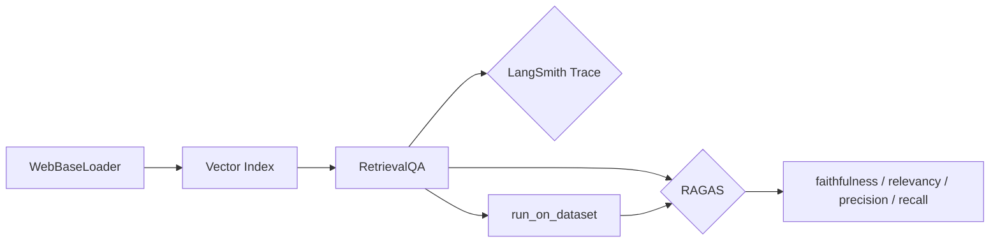

# LangChain × RAGAS × LangSmith 联合评估 RAG 应用

在 **LangChain 1.x** 与 **ragas 0.2.x** 下，完成：网页 RAG → `RetrievalQA` → RAGAS 四维指标 → LangSmith 追踪与数据集批量评估。

> 本项目用 `RagasMetricRunEvaluator` 对接 `run_on_dataset`。

## 项目结构

```
langchainRagasSmith/
├── rag_eval/                    # 核心包
│   ├── config/                  # 环境、模型、默认用例
│   │   ├── settings.py
│   │   └── cases.py
│   ├── rag/                     # 文档加载、索引、QA 链
│   │   └── pipeline.py
│   ├── evaluation/              # RAGAS 单条 / 批量评估
│   │   ├── ragas_metrics.py
│   │   ├── single.py
│   │   └── batch.py
│   ├── integrations/langsmith/  # 数据集、run 查询、冒烟测试
│   └── cli.py                   # 统一命令行
├── scripts/                     # 脚本入口（等价 cli 子命令）
├── data/                        # 评估用例示例 JSON
├── .env.example
├── requirements.txt
├── pyproject.toml
└── rag_demo.py                  # 兼容旧入口
```

## 快速开始

```bash
cd d:\AiLiao\langchainRagasSmith
python -m venv .venv
.venv\Scripts\activate
pip install -r requirements.txt
# 或: pip install -e .

copy .env.example .env
# 编辑 .env：LLM_API_KEY、可选 LANGCHAIN_API_KEY
```

### 环境变量

| 变量 | 必填 | 说明 |
|------|------|------|
| `LLM_API_KEY` | 是 | 硅基流动 / DeepSeek 等 |
| `LLM_API_BASE` | 否 | OpenAI 兼容 Base URL |
| `LLM_MODEL` | 否 | 对话模型 |
| `EMBEDDING_MODEL` | 否 | 向量模型 |
| `LANGCHAIN_API_KEY` | 批量评估 | `ls__` 或 `lsv2_pt_` |
| `LANGCHAIN_TRACING_V2` | 否 | `true` 开启追踪 |
| `LANGCHAIN_PROJECT` | 否 | 如 `test-ragas2` |

## 运行方式

**推荐：统一 CLI**

```bash
rag-eval smoke          # LangSmith 追踪冒烟（约 10 秒）
rag-eval check          # 检查近 1 小时是否有 run 上报
rag-eval single         # 单条 RAG + RAGAS（约 3 分钟）
rag-eval batch          # LangSmith 数据集 + 批量 RAGAS
```

未安装包时可用模块方式：

```bash
python -m rag_eval.cli single
python -m scripts.run_single
python rag_demo.py
```

**LangSmith 控制台**

```text
https://smith.langchain.com/o/-/projects/p/test-ragas2
```

## 流程说明


